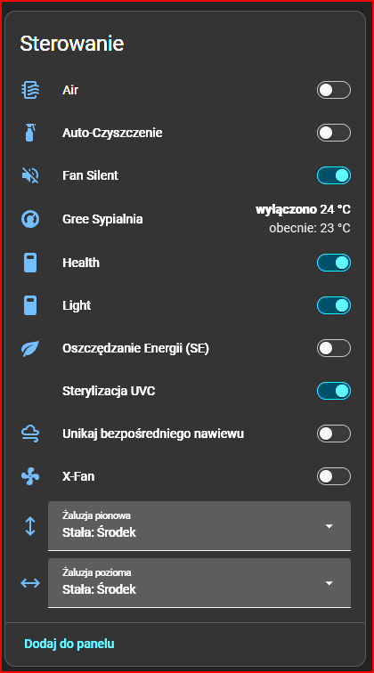
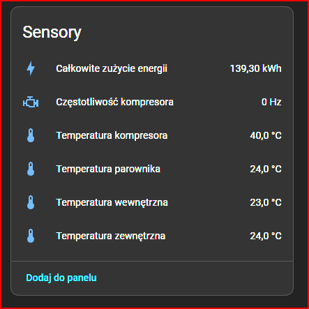

# Gree Climate Cloud (Custom Fork)

Alternatywna, mocno rozszerzona integracja dla Home Assistant, pozwalająca na sterowanie klimatyzatorami i pompami ciepła Gree (oraz OEM) z wykorzystaniem chmurowego API i protokołu MQTT. 

Jest to ratunek dla urządzeń, które po automatycznej aktualizacji modułu Wi-Fi do wersji **V2.12+** straciły możliwość komunikacji lokalnej (zablokowany port UDP 7000) i przestały działać z oficjalną, wbudowaną integracją Home Assistant.

## 🚀 Co odróżnia ten fork od oryginału?
Ten kod wymusza na serwerach Gree przesyłanie pełnych paczek diagnostycznych (odblokowując odczyt ze 149 ukrytych parametrów). Względem oryginalnej integracji dodano:

* 🌡️ **Surowe odczyty z płyty głównej:** Odczyt rzeczywistej temperatury z czujnika wewnątrz pokoju, temperatury na zewnątrz budynku (agregat), temperatury sprężarki oraz chłodnicy (parownika).
* ⚡ **Diagnostyka inwertera:** Odczyt częstotliwości pracy kompresora (w Hz) oraz całkowitego zużycia energii w kWh.
* 🌬️ **Zaawansowane sterowanie nawiewem (Select):** Zastąpiono suwaki dedykowanymi listami rozwijanymi. Możesz teraz nie tylko włączyć/wyłączyć swing, ale precyzyjnie zablokować żaluzję pionową i poziomą w jednej z 5 stałych pozycji.
* 🛠️ **Nowe przełączniki (Switches):**
  * Blokada rodzicielska (Child Lock)
  * Sterylizacja UVC (UvcControl)
  * Wygaszanie ekranu / praca z czujnikiem światła (Dazzling)
  * Unikaj bezpośredniego nawiewu (Anti-Direct Blow)
  * Agresywne oszczędzanie energii (SvSt)
  * Samoczyszczenie (AutoClean)

## 📦 Instalacja przez HACS (Zalecane)

Upewnij się, że masz przygotowany plik `hacs.json` w swoim repozytorium.
1. Otwórz Home Assistant i przejdź do zakładki **HACS** -> **Integracje**.
2. Kliknij w menu (trzy kropki w prawym górnym rogu) i wybierz **Niestandardowe repozytoria**.
3. Wklej URL do tego repozytorium: `https://github.com/piaassek/gree_cloud`
4. Jako kategorię wybierz **Integracja** i kliknij Dodaj.
5. Zamknij okno, wyszukaj w HACS `Gree Climate Cloud (Custom)` i zainstaluj.
6. Zrestartuj Home Assistanta.

## ⚙️ Konfiguracja
Po ponownym uruchomieniu HA:
1. Przejdź do **Ustawienia** -> **Urządzenia oraz usługi** -> **Dodaj integrację**.
2. Wyszukaj **Gree Cloud**.
3. Podaj region swojego serwera (np. `Europe`), swój e-mail do konta Gree+ oraz hasło.

Urządzenia zostaną automatycznie wykryte i dodane do systemu (uwaga: odczyt dodatkowych parametrów jak temperatury diagnostyczne może zająć do kilkudziesięciu sekund od pierwszego uruchomienia).